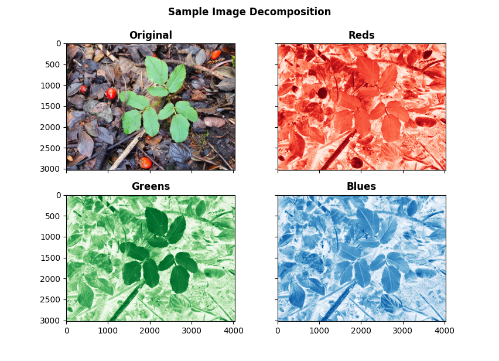
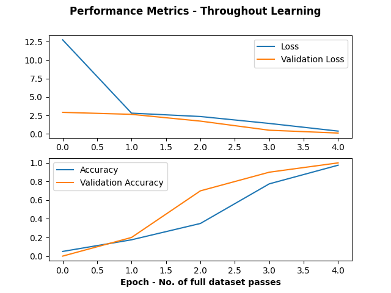

# MachineLearningForPlants
Repository for machine learning practice applied to plants.

The main script can be used as following: ```python full_pipeline.py -d <data_location>``` where the data location points to a directory containing the data. That directory should also contain only subdirectories which are the labels of the images. That is, all the images you wish to train and validate and test on should have been categorised into sub directories already. From there, we do the following:

1. Read in the input data, and create a dataset ready to train and test on.
2. Build an example convolutional neural network (CNN) and pass the split data for training, validation and testing.
3. Plot the performance metrics loss and accuracy in the output directory. The history/logs are also stored in the logs directory in output.

## Sample Image Decomposition

In the future, for something like leaf counting or semantic segmentation, it might be better to pass decomposed RGB images for leaf object detection, pixel classification. See the below example where each layer of the image is shown separately compared to the original.



##Example Performance Output Plot

The ```full_pipeline.py``` script will plot the metrics in the output directory, should look something like the following.



