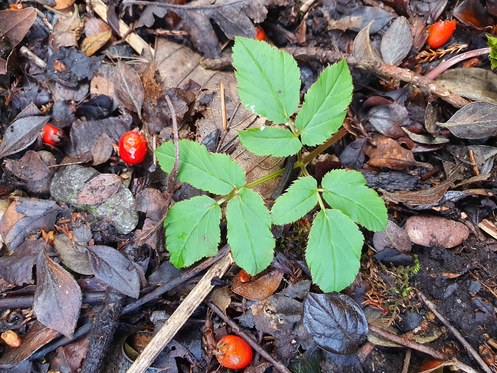

# MachineLearningForPlants
Repository for machine learning practice applied to plants.

## Usage: python full_pipeline.py -d [DATA_LOCATION]

## Sample Image Decomposition
In the future, for something like leaf counting or semantic segmentation, it might be better to pass decomposed RGB images for leaf object detection, pixel classification. See the below example where each layer of the image is shown separately compared to the original.

